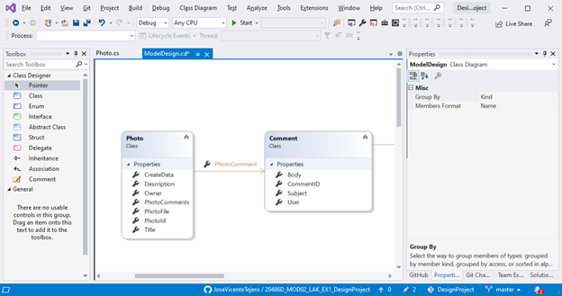
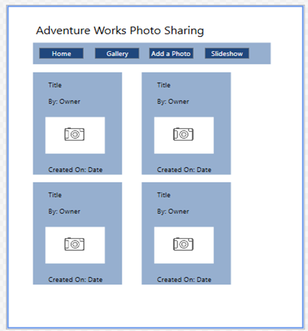
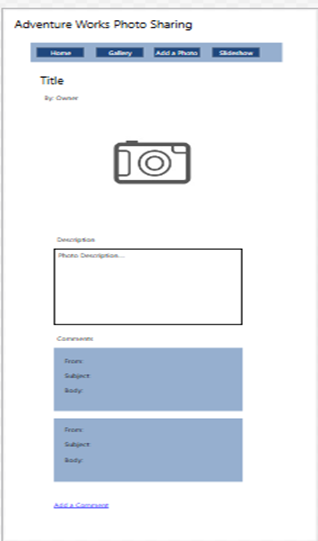

Exercise 1: Planning Model Classes

JOSE VICENTE TEJERO CALDERERA - 27/11/2020

RESUMEN El objetivo es diseñar una aplicación paso a paso, describiendo en el fichero word DetailedPlannignDocument_ES.doc el modelo, vistas y controladores, así como recomendaciones de alojamiento y de Base de datos.

PROBLEMAS No
